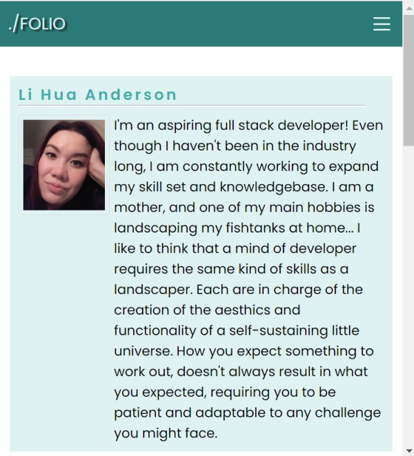

# Portfolio
A collection of past Projects and Apps

## Objectives

The Project was to create a completely new code, site directory format, and repository for a portfolio I will use to add future projects to while in the bootcamp. App was also expected to be responsive at different breakpoints.

## Development

Began by making a repository on github, and creating all necessary structural files for the App within gitbash. These included the index.html, as well as the assest directory containing all directories for CSS, JS, and images.

Added semantic HTML structure in index.html to flesh out basic structure of the site, as well as add some CSS styling. CSS resets were included in style.css rather than linking to an additional external file. Began commenting on CSS at this time as well.

Knew I wanted to create a 'hamburger' style menu toggle that appears when browser is maxwidth of 650px. Added css Stying to the divs for the 'hamburger icon' as well as javascript. I did follow a tutorial to get an idea of the basic javascript required for this task. But it was heavily edited and styled for my own purposes. Link to the tutorial is provided below.

Made sure all Navigation links were working and pointed to the separate section IDs throught the page.

Wrote the content for each section, and added a Photo of myself in the about section. This image was styled in CSS to resize with the screen resolution as well. Made sure to include very short ALT tag with Photo. Also added links to the contact section, and styled these in CSS when hovered over. Each link opens in a new window.

Created CSS cards to contain information of each new App within the projects section. Addresed the issue of making the first proect bigger by using CSS styling .card:first-of-kind. These cards were also styled within CSS to be responsive and resize with resolution size. Added an additional breakpoint to the media queries at this time to maintain an attractive ratio aspect. 

Added project images to each card and styled them within CSS to be responsive on hover. Also added links to these images to link to project on cick. Also added a hover status to each card, so card size is increased when hovered over, increasing focus. The information for the first App we completed was added, and place holder and images was added to projects below until they can be updated with new content.

Created README for App.

---

## [Link to Deployed App](https://chopsushi206.github.io/Portfolio/)

Below are screenshots of the App.

---

## Resources

Tutorial used for the responsive Javascript navigation is [here](https://www.youtube.com/watch?v=gXkqy0b4M5g) and created by Dev Ed on youtube. Did not completely follow his style of menu as mine is horizontal and not vertical. Also added script to toggle the menu closed onclick which was not done in the tutorial.

[Google Fonts](https://fonts.google.com/) For fontstyle Poppins was also used.

## Developer

 Coding and repository done by [Li Hua Anderson](https://github.com/chopsushi206).

[Email](mailto:lihua.anderson@gmail.com) | [LinkedIn](https://linkedin.com/in/li-hua-anderson-b259b7144)